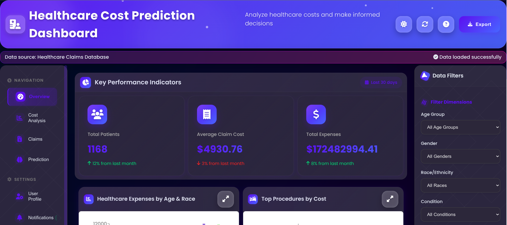

# Healthcare Dashboard

A comprehensive healthcare analytics dashboard built with React and Node.js, featuring cost predictions and data visualization.




## Overview

This dashboard provides insights into healthcare costs, patient data, and medical trends using data from multiple healthcare sources. It visualizes healthcare costs across different cities and provides predictive analytics for healthcare expenses.

## Features

- Healthcare cost predictions
- City-wise cost comparison
- Interactive data visualization
- Patient data analytics
- Medical trend analysis
- Real-time data updates

## Tech Stack

- Frontend: React.js
- Backend: Node.js/Express
- Data Visualization: Recharts
- Data Processing: CSV Parser

## Project Structure

```
healthcare-dashboard/
├── server/
│   ├── server.js
│   └── data/
│       ├── careplans.csv
│       ├── conditions.csv
│       ├── medications.csv
│       └── observations.csv
└── src/
    ├── components/
    │   ├── HealthcareDashboard.js
    │   ├── CityCostComparison.js
    │   └── SimpleDashboard.js
    └── App.js
```

## Installation

1. Clone the repository:
```bash
git clone https://github.com/nagapavanmuni/healthcare-dashboard.git
cd healthcare-dashboard
```

2. Install dependencies:
```bash
npm install
```

3. Start the development server:
```bash
npm run dev
```

## Available Scripts

### `npm run dev`
Runs both the backend server and React frontend concurrently.
- Frontend: [http://localhost:3000](http://localhost:3000)
- Backend: [http://localhost:5000](http://localhost:5000)

### `npm start`
Runs only the React frontend in development mode.

### `npm test`
Launches the test runner in interactive watch mode.

### `npm run build`
Builds the app for production to the `build` folder.

## API Endpoints

- `GET /api/healthcare-costs`: Retrieves healthcare cost data
- `GET /api/city-comparison`: Gets city-wise cost comparison data
- `GET /api/patient-data`: Fetches patient statistics

## Data Sources

The dashboard uses various healthcare datasets located in `server/data/`:
- Care Plans
- Medical Conditions
- Medications
- Patient Observations
- Healthcare Providers
- Medical Procedures

## Contributing

1. Fork the repository
2. Create your feature branch (`git checkout -b feature/AmazingFeature`)
3. Commit your changes (`git commit -m 'Add some AmazingFeature'`)
4. Push to the branch (`git push origin feature/AmazingFeature`)
5. Open a Pull Request

## License

This project is licensed under the MIT License - see the LICENSE file for details.

## Acknowledgments

- Create React App documentation
- Express.js
- Recharts library
- Healthcare data providers

For more information about Create React App, visit the [official documentation](https://facebook.github.io/create-react-app/docs/getting-started).